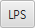

.. _autopilot_parameters:

Настройка параметров автопилота Пионера Мини
============================================

Параметры полета квадрокоптера в ручном и автоматическом режиме можно тонко настроить, используя программу :doc:`../../../programming/pioneer_station/pioneer_station_main`. Для настройки "Пионер Мини" должен быть подключен к компьютеру, для перехода к настройке откройте вкладку "Параметры автопилота", текущие параметры должны отображаться в правой части окна.

.. note:: Настоятельно рекомендуем обновить параметры вашего "Пионер Мини". Параметры автопилота "Пионер Мини" и базового "Пионера" различаются имейте это в виду. Это связано с различной электронной начинкой квадрокоптеров.

.. attention:: Перед загрузкой параметров, обязательно обновите прошивку автопилота, это очень важно! Как это сделать вы можете просмотреть в разделе
               :doc:`firmware_upgrade`.

.. contents::
	:local:
	:backlinks: none 

Загрузка параметров Пионера Мини
--------------------------------

Для загрузки параметров авопилота в "Пионер Мини" выполните следующие инструкции:

1. Скачайте файл параметров в удобную для вас папку. В большинстве случаев, рекомендуемые параметры находятся в архиве с прошивкой и имеют расширение **.properties**. 

.. important:: Обратите внимание. Параметры автопилота для управления через `приложение`_ и для управления с помощью `пульта радиоуправления`_ различаются! По ссылкам ниже вы можете скачать актуальные варианты параметров для версии автопилота |utd_ap_mini|. |br| Для возврата к управлению через приложение Jump - загрузите параметры для управления с помощью приложения.

* `Для управления с помощью приложения <https://disk.yandex.ru/d/fdTyvffNctHW3A>`__

* `Для управления с помощью пульта РУ <https://disk.yandex.ru/d/9mX2dscMv4NljA>`__

2. Подключитесь к Пионер Мини с помощью Pioneer Station. Нажмите кнопку **"Открыть из файла"** |upload| 

3. В диалоговом окне укажите путь к папке с параметрами, после чего выберите необходимый файл с расширением **.properties** и нажмите **"Открыть"**.

	.. figure:: media/open_prop.png

4. В открывшемся окне, вы увидите отличающиеся значения. Изображение снизу является примером. В колонке "Автопилот" отображаются текущие параметры, в столбце "Файл" находятся новые значения параметров которые будут изменены. Нажмите кнопку "ОК".

	.. figure:: media/different_param.PNG

5. Для загрузки новых параметров нажмите кнопку **"Cохранить изменения на автопилот"** |push| и дождитесь окончания перезагрузки.

6. Нажмите кнопку **"Обновить из автопилота"** |update| чтобы проверить, изменились ли параметры.

7. Хороший признак того, что вы всё сделали правильно, это то, что сзади на квадрокоптера светодиод мигает фиолетовым цветом.

В верхнем меню Pioneer Station присутствуют кнопки |btnLPS| и |btnOPT|. Каждая из них загружает в квадрокоптер стандартный набор параметров для полета, соответственно, в локальной системе позиционирования и полёта с помощью модуля оптического позиционирования.

.. important:: На данный момент времени, никаких кнопок нажимать не надо. Оптический поток включен по умолчанию и выставлены оптимальные параметры. Встроенный модуль оптического позиционирования позволяет вам летать в помещениях с достаточным освещением. Остальные режимы будут добавлены со временем.

Изменение текущих параметров
----------------------------

Перейдите во вкладку **"Параметры автопилота"**. В первом столбце таблицы приведены названия параметров. Назначение каждого из них описано в крайнем правом столбце **"Описание"**. Во втором столбце отображаются текущие значения параметров автопилота.

	.. figure:: media/parametrsAP_1.PNG

Если вы хотите поменять какое-либо из них, введите новое значение в столбец **"Новое значение"** и нажмите Enter. Завершив редактирование, не забудьте сохранить изменения, нажав кнопку **"Cохранить изменения на автопилот"** |push|

Также вы имеете возможность открыть полный список параметров автопилота отметив чекбокс **"Все параметры"**

.. danger:: Самостоятельное изменение некоторых параметров может непреднамеренно привести к фатальным ошибкам работы автопилота. Если вы не знаете что это за параметры, лучше их не изменять.

Сохранение текущих параметров
-----------------------------

Pioneer Station позволяет сохранять свои сборки параметров автопилота. Для этого нажмите кнопку **"Сохранить в файл параметры автопилота"** |download|. Рекомендуется сохранять старые параметры АП перед загрузкой новых, чтобы в случае необходимости вернуться на старые параметры.

.. tip:: Если у вас не получилось по каким либо причинам загрузить параметры автопилота, советуем перезапустить Pioneer Station.

Если у вас возникли вопросы по изменению тех или иных параметров, вы всегда можете обратиться в техподдержку написав на почту support@geoscan.aero или в `telegram-канал <https://t.me/geoscan_edu>`_.

..

.. _пульта радиоуправления:  https://docs.geoscan.aero/ru/master/instructions/pioneer-mini/settings/rc_setting.html

.. _приложение: https://docs.geoscan.aero/ru/master/instructions/pioneer-mini/flight/geoscan_jump.html