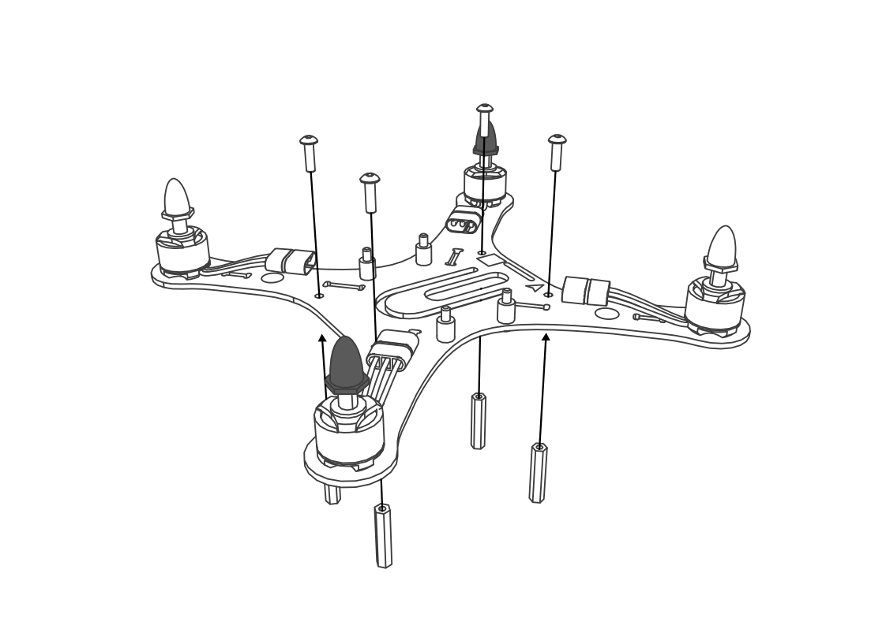

Сборка рамы
===========

Шаг 1
~~~~~

**Используются:** Основание рамы; Мотор правого вращения - 2 шт; Мотор левого вращения - 2 шт; Винт M2x4 - 8 шт.

Места установки моторов с серебристыми гайками отмечены на основании рамы белыми кругами. Следуя цветовой маркировке, установите моторы на основание рамы и закрепите каждый мотор двумя винтами, расположив их по диагонали.

.. attention:: На данном шаге используются винты M2x4. Их легко перепутать с винтами M2x6 и повредить обмотку моторов при их установке. Сориентироваться поможет тот факт, что это самые маленькие винты в наборе.

Шаг 2
~~~~~

**Используются:** Узел, собранный на шаге 1; демпферы – 4 шт; винты M3х4 - 4 шт.

Установите демпферы на основание рамы и закрепите их винтами М3х4 с противоположной стороны, как показано на рисунке.

Шаг 3
~~~~~

**Используются:** Узел, собранный на шаге 2; Cтойки длинные 4 - шт; Винты M3х10 - 4 шт.

Установите стойки с нижней стороны крестовины рамы и закрепите их винтами М3х10, как показано на рисунке.

Шаг 4
~~~~~
**Используются:** Плата подключения доп.модулей; Cтойки короткие 4 - шт; Винты M3х5 - 4 шт.

С помощью винтов М3х5 закрепите стойки на плате подключения доп.модулуй, как показано на рисунке. Эти стойки могут потребоваться в дальнейшем для крепления дополнительных модулей.

Шаг 5
~~~~~
**Используются:** Узел, собранный на шаге 3; Шасси-верх; Шасси-низ.

Совместите верхнее и нижнее шасси, после чего установите их в соответствующие пазы, расположенные на основании рамы. 

Шаг 6
~~~~~
**Используются:** Узел, собранный на шаге 4; Узел, собранный на шаге 5; Торец отсека аккумулятора; Винты M3x10 - 4 шт. 

С помощью винтов М3х10 зафиксируйте плату доп. модулей на стойках под основанием рамы. В промежутке установите торец отсека аккумулятора совместив его с соответствующими пазами в основании рамы и в плате подключения доп. модулей. 

.. attention:: Направление стрелки на нижней стороне платы доп.модулей должно совпадать с направлением стрелки на основании рамы! 

Шаг 7
~~~~~

**Используются:** Узел, собранный на шаге 6; Плата автопилота; Стойки металлические короткие - 4 шт. 

С помощью металлических стоек зафиксируйте плату автопилота на демпферных стойках. Подключите моторы к плате автопилота.

.. attention:: Направление стрелки на плате автопилота должно совпадать с направлением стрелки на основании рамы! 

Шаг 8
~~~~~

**Используются:** Узел, собранный на шаге 7; Пропеллеры левого вращения(5030) - 2 шт; Пропеллеры правого вращения(5030R) - 2 шт.

Установите пропеллеры таким образом, чтобы их маркировка(обозначающая направление вращения) совпадала с маркировкой на каждом луче Пионера.

Шаг 9
~~~~~

**Используются:** Узел, собранный на шаге 8; 10-контактный шлейф - 1 шт; 12-контактный шлейф - 1 шт.

Подключите плату дополнительных модулей к автопилоту с помощью двух шлейфов.

.. attention:: Убедитесь, что шлейф совпадает по количеству контактов с подключаемым разъёмом! Подключение шлейфа к несоответствующему разъёму приведёт к выходу оборудования из строя! 

Шаг 10
~~~~~~

**Используются:** Узел, собранный на шаге 9; Приёмник FS-A8S - 1 шт; Фиксирующая трубка- 1 шт.

Закрепите приемник на ножке шасси с помощью эластичного фиксатора. Вставьте разъем кабеля в разъем PPM на базовой плате (Разъем PPM находится под разъемом micro-USB).  

Собрав раму "Пионера", перейдите к разделу :doc:`const_protection`