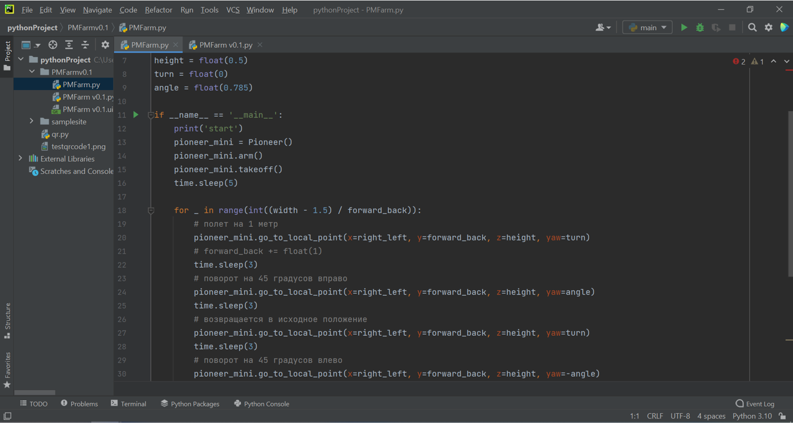
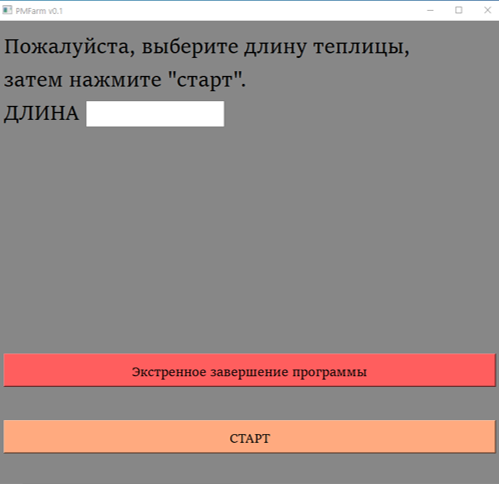

Использование Pioneer Mini в сельском хозяйстве
===============================================

.. raw:: html

   

        <iframe src="https://www.youtube.com/embed/IEambQteG8Y?list=PLV31ZusyYaebzbHk7L3fdJneqxzEnBbap" allowfullscreen="" style="position: absolute; width:100%; height: 100%;" frameborder="0"></iframe>
   

Участники проекта
-----------------

**Автор проекта:** Ситников Иван Владимирович. КОГОБУ СШ с УИОП г. Белой Холуницы;

**Проектный наставник** Гнусова Анна Леонидовна.

Описание и цель проекта
-----------------------

Целью проекта является создание приложения позволяющего задавать квадрокоптеру Pioneer Mini расстояние и траекторию полёта для последующего искусственного опыления растений и применения в сельском хозяйстве.
Почему проблема опыления сельскохозяйственных растений в теплицах на данный момент актуальна? Всё дело в том, что теплицы лишены порывов ветра, который обеспечивает естественное опыление. Создание программы, которая позволит дрону создавать воздушные потоки и опылять растения в замкнутых пространствах, поможет решить данную проблему и облегчит жизнь многих фермеров.  

Решаемые задачи
---------------

* Знакомство с документацией и ресурсами по теме проекта
* Знакомства с системой навигации в помещении
* Знакомство с языком программирования Python
* Разработка сценария работы программы для механического опыления растений.

Этапы разработки
----------------

1) Сборка квадрокоптера Pioneer Mini
2) Знакомство с библиотекой `pioneer_sdk`_ и её методами
3) Работа в редакторе кода PyCharm Community Edition

Пример Python-скрипта в PyCharm Community Edition

4) Работа с тех. поддержкой (Взаимодействие с разработчиками)
5) Программирование квадрокоптера GEOSCAN Pioneer MINI
6) Полётные испытания
7) Cоздание функции экстренного завершения полёта
8) Испытания программы

Внешний вид программы "PMFarm"

Результат
---------

* Поставленная цель была достигнута. Результатом является программа PMFarm для опыления сельхозяйственных растений с помощью Pioneer Mini. В ходе испытания сделаны выводы о том, что поставленная задача проекта выполнена.
* В ходе работы над проектом я научился основам работы в PyCharm Community Edition и работе c Python скриптами.
* Данная тема показалась интересной, поскольку можно продолжать работу над ней. В дальнейшем я планирую работать с этой темой, добавляя новые функции в программу и совершенствуя её.

* Ссылка на EXE файл - `Yandex Disk <https://disk.yandex.ru/d/sCiUckS28Fl72g>`__
* Проект на `GitHub <https://github.com/CodeWAds/PMFarm_v0.1>`__

.. _pioneer_sdk:  https://docs.geoscan.aero/ru/master/programming/python/pioneer-sdk-methods.html