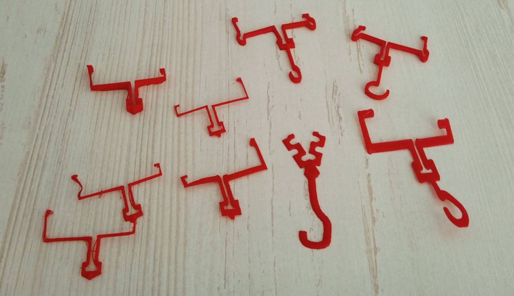
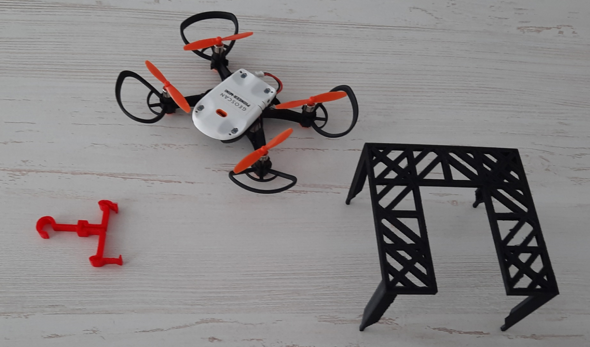

Модификация корпуса Пионера Мини крюком захвата
===============================================

.. raw:: html

   

        <iframe src="https://www.youtube.com/embed/I_H3c-ByGN0?list=PLV31ZusyYaebzbHk7L3fdJneqxzEnBbap" allowfullscreen="" style="position: absolute; width:100%; height: 100%;" frameborder="0"></iframe>
   

Участники проекта
-----------------
Центр образования цифрового и гуманитарного профилей «Точка роста», с.Кулунда, Кулундинский район, Алтайский край.

**Автор проекта:** Плеханов Виталий с. Кулунда

**Проектный наставник:** Еске Алексей Александрович.

Описание и цель проекта
-----------------------

Создание универсального устройства захвата в виде крюка.

Решаемые задачи
---------------

* Освоение программы Blender
* Разработка устройства захвата
* Разработка стартовой площадки
* Проведение тестовых полётов и проверка устройства.

Этапы разработки
----------------

Создание пробных образцов захвата и площадок.

.. container:: flexrow

	.. figure:: media/img01.jpg

	.. figure:: media/img02.jpg

Результат
---------

В результате проведённых экспериментов был спроектирован и построен готовый к использованию опытный образец крюка.

