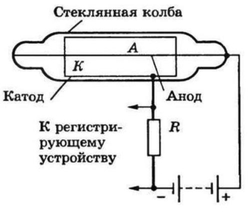
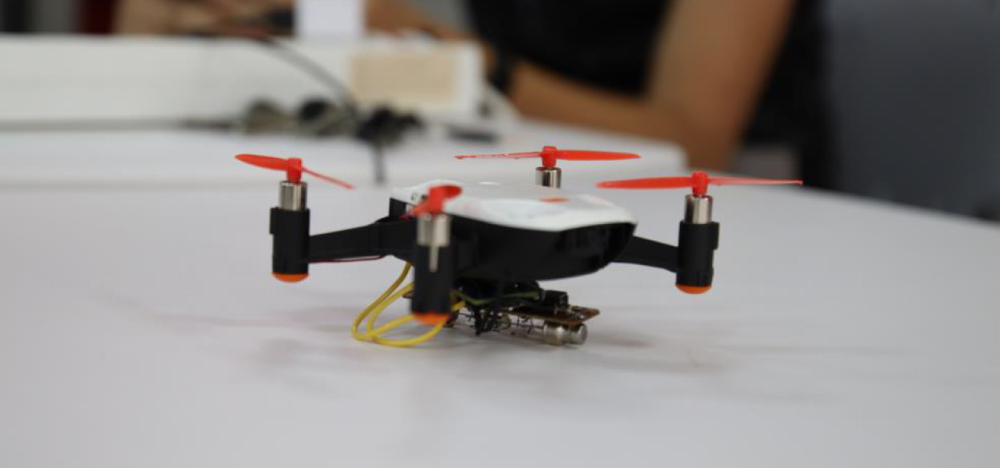

Измерение радиационного фона окружающих предметов
=================================================

.. raw:: html

   

        <iframe src="https://www.youtube.com/embed/UK71Azp1cQg?list=PLV31ZusyYaebzbHk7L3fdJneqxzEnBbap" allowfullscreen="" style="position: absolute; width:100%; height: 100%;" frameborder="0"></iframe>
   

Участники проекта
-----------------

**Команда:** "« Team Spectrum», Тамбовская область, Первомайский район, посёлок Первомайский

**Участники:**
 - | Свиридов Артём Сергеевич
 - | Гусеев Дмитрий Михайлович
 - | Моисеев Никита Андреевич.

**Проектный наставник:** Соколов Александр Евгеньевич.

Описание и цель проекта
-----------------------

Участники команды выбрали тему радиации не зря. Так они раскрывают важность выбранной темы: «Только в эпоху развитого информационного общества человечество начало понимать опасность использования радиационных материалов в глобальных масштабах. Первое понимание, наверное, пришло во время катастрофы на Чернобыльской АЭС в 1986 году. Именно эта катастрофа показала, какие социальные, моральные, этические, экономические издержки несет радиация. Но это случилось уже более 30 лет назад. Однако  авария на АЭС Фукусима 1 в Японии в 2011 году только подтвердила тезис о том, что с «мирным» атомом при ненадлежащем обращении шутки плохи. Радиация губительно действует на биологические объекты, разрушает ДНК, приводит к генетическим изменениям клеток. При получении высокой дозы радиации клетки не успевают регенерироваться. Чаще всего это приводит к отказу некоторых органов и гибели организма, либо к мутациям.»

**Цель проекта:** Создание летательного аппарата с возможностью измерения радиационного фона окружающей среды и объектов.

Более подроно ознакомиться с проектом можно на сайте `Точка роста <https://tochkarosta.pervsosh.ru/hpioner/>`__

Решаемые задачи
---------------

* Изучить материалы в сети Интернет на тему радиации и способов её измерения
* Создать прототип устройства и написать программы для его работы
* Осуществить настройки прибора
* Провести исследование радиационного фона окружающих предметов
* Провести тестовый полёт. Сформировать вывод и оценить проделанную работу.

Этапы разработки
----------------

1) В первую очередь, нужно понять, что такое радиация. Это исходящий от любого источника поток частиц, квантов электромагнитного излучения, приводящий к ионизации атомов и молекул вещества. К ионизирующему излучению относятся ультрафиолетовое, рентгеновское и радиоактивное излучение. Далее мы будем рассматривать только последний вид излучения, которое возникает при радиоактивном распаде атомных ядер.

2) Изучить принцип работы дозиметра. Дозиметр это прибор, предназначенный для измерения уровня радиации. Чаще всего, для измерения радиации используется счётчик Гейгера-Мюллера. Принцип работы счётчика таков: устройство состоит из герметичного металлического или стеклянного баллона, наполненного инертным газом (неон, аргон) или газовой смесью.

3) Изучить устройство самого счётчика. Внутри баллона имеются электроды: катод и анод. Электроды подключаются к источнику высокого напряжения постоянного тока через нагрузочный резистор, на котором формируются электрические импульсы при прохождении частиц через баллон. В исходном состоянии газовый промежуток между электродами имеет высокое сопротивление и тока в цепи нет. Когда заряженная частица, имеющая высокую энергию, сталкивается с элементами конструкции датчика (корпус, баллон, катод), она выбивает некоторое количество электронов, которые оказываются в промежутке между электродами. Под действием ускоряющего напряжения в несколько сотен вольт электроны, находящиеся в инертном газе, начинают устремляться к аноду. При подключении осциллографа мы увидим импульсы напряжения, возникающие при пролете частиц.

При пролете частицы через стеклянную трубку возникает импульс пикообразной формы, который подается на формирователь импульсов. С формирователя уже прямоугольный импульс с выхода INT подается на цифровой вход счетчика импульсов, собранный на ESP.

Также на плате имеется высоковольтный преобразователь напряжения (для работы счётчика требуется 400 вольт). Счётчик и преобразователь (рисунок 1) распаяны на единой плате, преобразователь напряжения распаян в соответствии со схемой, изображённой на рисунке 2.

.. container:: flexrow

	.. figure:: media/img02.jpg

	.. figure:: media/img03.jpg

4) Создание веб интерфейса, на который выводится вся полученная информация. Интерфейс написан на PHP, JS и C++ (программная часть контроллера ESP).

5) В веб-интерфейс добавлены дополнительные настройки: звуковое и визуальное оповещение при повышенном уровне радиации. С работой веб-интерфейса можно ознакомиться в видеоролике.

.. container:: flexrow

	.. figure:: media/img04.jpg

	.. figure:: media/img05.jpg

Результат
---------

Проверка работоспособности прибора проводилась несколько раз. Сбоев в работе прибора не наблюдалась. Ложные срабатывания отсутствовали.

.. container:: flexrow

	.. figure:: media/img06.jpg

	.. figure:: media/img07.jpg

Было проведено несколько исследований и сделав выводы:

1) По результатам измерений средний уровень фона окружающих предметов составил 14 мкР/ч;
2) Дозиметр, установленный поверх кюветы с чистым хлоридом калия, четко фиксирует повышение радиационного фона примерно до 19 мкР/ч. Полученные результаты показывают, что устройство работает корректно.

**Вывод:** Поставленные в проекте задачи были выполнены. Устройство получилось удачным как в плане эргономичности, так и в плане качества работы. Прибор точно фиксирует повышение уровня радиации. Его можно использовать для измерения уровня радиации в труднодоступных для человека местах, что делает данный проект актуальным.

