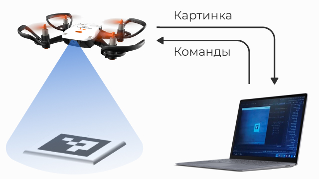
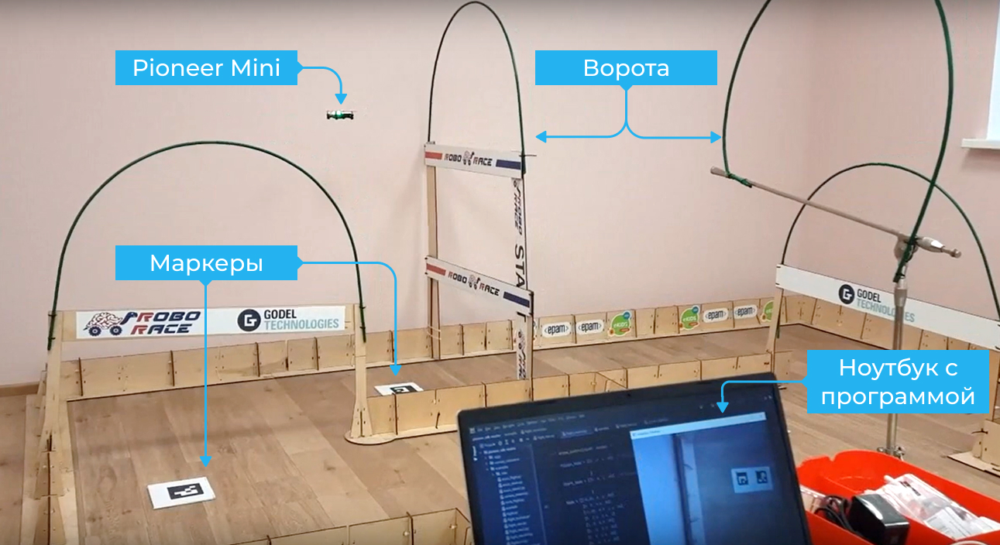

Полёт по Aruco-меткам
=====================

.. raw:: html

   

        <iframe src="https://www.youtube.com/embed/08tLcb7mygw?list=PLV31ZusyYaebzbHk7L3fdJneqxzEnBbap" allowfullscreen="" style="position: absolute; width:100%; height: 100%;" frameborder="0"></iframe>
   

Участники проекта
-----------------

**Автор работы:** Козинцев Максим Леонидович. Учащийся ГУО «Средняя школа д."Черни", Брестский район, Республика Беларусь;

**Проектный наставник:** Постоялко Александр Викторович

Описание и цель проекта
-----------------------
В Беларуси ежегодно проходят соревнования по робототехнике в формате «Кубка образовательной робототехники», проходящего в течение года в городах Беларуси с финалом в г.Минске. Одна из категорий – Программируемые дроны. Мы давно хотели поучаствовать в этой категории, однако ввиду отсутствия подходящих квадрокоптеров смогли осуществить это желание только в сезоне 2021/22, когда осенью 2021 года спонсор оплатил нам два квадрокоптера Пионер Мини с комплектом аккумуляторов и зарядных устройств. Данный проект возник и развивался  ходе подготовки к участию в соревнованиях,  поэтому некоторые решения могут показаться не совсем логичными, но они проистекают из правил данной категории.

Проект представляет собой написание программы на языке Python с использованием возможностей библиотек pioneer-sdk и aruco.
Возможности программы:

 * Автономный полет с использованием локальной системы координат
 * Уточнение точек автономного полета при помощи маркеров aruco 
 * При обнаружении нескольких маркеров в поле зрения выбор необходимого маркера
 * Использование отдельных программируемые процедур после взлета и перед посадкой
 * Возможность циклического выполнения основной части полетного задания
 * Поиск aruco маркера, если в контрольной точке он не обнаружен

Решаемые задачи
---------------

Данную программу можно использовать на различного рода соревнованиях с использованием программируемых БПЛА, где разрешается применять дополнительные маркеры. 
Полетные задания прописываются и корректируются легко и удобно, благодаря применению системы относительных смещений от точки к точке. 
Также данная программа может быть использована для полетов по точкам без привязки к маркерам, по аналогии с обычными LUA скриптами. 
В целом, программа получилась достаточно простой и универсальной.

Этапы разработки
----------------

Взаимодействие с Pioneer Mini
~~~~~~~~~~~~~~~~~~~~~~~~~~~~~
Управление квадрокоптером осуществляется путем получения изображений со встроенной камеры, обработки этих изображений на ноутбуке и отправке команд управления обратно на квадрокоптер.
Связь происходит по радиоканалу с использованием технологии WiFi. Маркеры aruco располагаются на полу, соответственно камеру на квадрокоптере необходимо повернуть в креплении, чтобы она смотрела вниз.

Aruco-маркеры
~~~~~~~~~~~~~
Первоначально для полетов использовалась библиотека маркеров 6х6 с размером 120х120мм, как в примере aruco_flight с сайта Geoscan. Однако объем библиотеки в 1000 маркеров явно избыточен для нашего применения, поэтому мы перешли на библиотеку 4х4 с размером маркера 100х100мм и объемом 50 маркеров.

Такого количества маркеров вполне достаточно, в реальном задании мы используем обычно около десятка. Уменьшение размеров маркера  немного помогает при ориентировании, когда маркер попадает в край кадра. В то же время из-за меньшего количества элементов на маркере распознавание не ухудшается.

Написание программы
~~~~~~~~~~~~~~~~~~~

Поскольку практического опыта в программировании на Python с использованием OpenCV у нас не было, программа создавалась путем поэтапной модернизации примера `aruco_flight`_.

Первое что было сделано, поскольку камера нашего Пионера смотрит вниз – была изменена логика управления при обнаружения маркера. 
Вместо сложных математических расчетов со смещением по всем трем осям задача свелась к банальным двум строчкам: 

::

	command_x += k_p_xy*(x_camera)
	command_y -= k_p_xy*(y_camera)

Управление по Z в данной версии производится строго по полетному заданию, в перспективе есть идея привязать высоту полета к номеру маркера. 

Собственно полетное задание теперь делится на три части:

* Действия после взлета – выполняются один раз после взлета (таблица Start_task)
* Основное полетное задание – может быть выполнено циклически в зависимости от переменной Laps (таблица task)
* Действия перед посадкой – выполняются после основного полетного задания для выхода в зону посадки (таблица Finish_task)

При обнаружении маркера квадрокоптер оценивает свое положение относительно его и если смещение составляет более 20см по любой оси – выполняется процедура корректировки положения. 
В планах еще сделать корректировку положения по курсу, с тем, чтобы в случае каких то воздействий на квадрокоптер, он мог подкорректировать свое вращение вокруг оси Z и корректно завершить задание. В данный момент этот функционал не реализован. 

Структура полетного задания выглядит так:

.. code-block:: python
 :class: codeblocksize1
 :linenos:

 task = [[0.5, 2.2, 0.7, 88],            
 [0.7, 1, 0.7, 99],
 [0.2, 1.1, 1.9, 5]
 ]

Каждая запись состоит из следующих полей:

.. code-block:: python
 :class: codeblocksize1
 :linenos:

 [X, Y, Z, N]

 # Где X, Y, Z - приращение координат по Х, Y и Z;
 # N - код маркера aruco, при обнаружении которого выполняется данный пункт полетного задания.
 # Зарезервированы следующие коды маркеров:
 # 88 - маркер с любым aruco кодом; 99 – маркер в конечной точке отсутствует

Для обеспечения более точного выполнения задания в случае, если в конечной точке перемещения ожидается маркер, но в поле зрения он отсутствует, квадрокоптер набирает высоту 2м для расширения поля обзора.

Для контроля, какую именно стадию полетного задания выполняет квадрокоптер в данный момент, была разработана и реализована следующая система цветовой сигнализации при помощи встроенных светодиодов:

* Синий 	– цель достигнута
* Зеленый 	– движение к новой точке
* Красный 	– маркер достигнут
* Белый 	– калибровка над маркером
* Желтый 	– поиск маркера

Практическая реализация полета
~~~~~~~~~~~~~~~~~~~~~~~~~~~~~~

Для практических полетов был изготовлен набор aruco маркеров в виде фанерных квадратов размером 18х18см. Сами маркеры напечатаны на листах обычной бумаги А4 и закреплены при помощи скотча. Такое решение, с одной стороны, утяжеляет маркеры, не позволяя им смещаться под воздействием воздушных потоков от винтов, а с другой – позволяет легко и быстро заменить маркеры (например на маркеры другой системы и/или размера) 

.. container:: flexrow

	.. figure:: media/img02.jpg

	.. figure:: media/img03.jpg

Остается только разложить маркеры на трассе, измерить расстояния перелетов от маркера к маркеру и написать полетное задание. 

Выявление недостатков
~~~~~~~~~~~~~~~~~~~~~

В ходе реальных соревнований выявились следующие недостатки данной программы, не позволившие нам завоевать призовые места:

1) Полет над недостаточно контрастной поверхностью приводит к довольно сильным промахам. Над соревнованиях использовалось черное поле с нанесенным на него белой полосой-трассой. Информации с такого покрытия недостаточно для точного полета;

2) Торможение и зависание квадрокоптера в конце каждого перелета приводит к увеличению времени выполнения полетного задания;

3) Самое неприятное – на соревнованиях диапазон 2.4ГГц очень сильно «забит» различными устройствами (wifi, bluetooth, радиомышки, радиоуправление моделями). В связи с этим, передача видео и команд управления по WiFi идет с ошибками и сбоями, в результате команды исполняются неточно и с запаздыванием.

В то же время на тренировках, над поверхностью пола имитирующую доску, в условиях отсутствия помех программа работает достаточно чётко и предсказуемо

Результат
---------

Разработка этой программы, все более совершенствуемой от соревнования к соревнованию, принесла нам большой опыт в программировании на языке Python. Приходилось учиться «на ходу», программировать, придумывать практические реализации наших идей. Также мы вполне успешно выступали на соревнованиях, пусть и без призов, но показывая реальные результаты.

 .. _aruco_flight: https://docs.geoscan.aero/ru/master/programming/python/sdk-scripts/aruco_flight.html