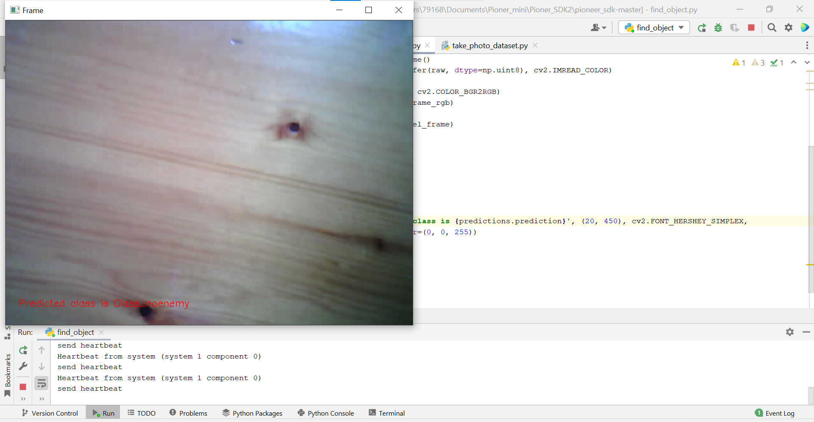

Проект «Боевая пчела»
=====================

.. raw:: html

   

        <iframe src="https://www.youtube.com/embed/P6PhwkE9nqI?list=PLV31ZusyYaebzbHk7L3fdJneqxzEnBbap" allowfullscreen="" style="position: absolute; width:100%; height: 100%;" frameborder="0"></iframe>
   

Участники проекта
-----------------

**Автор работы:** Петелина Ярослава Андреевна, ученица 6 класса ГБОУ г.Москвы №1391.

**Проектный наставник:** Петелина Дарья Сергеевна.

Описание и цель проекта
-----------------------

**Цель проекта:** Собрать карту из фотографий, полученных с дрона, и посчитать с помощью компьютерного зрения количество вражеской техники.

**Описание проекта:** 

* С помощью программы `Lobe`_ был обучен классификатор на три вида объектов: пусто, танк, РСЗО
* Квадрокоптер запрограммирован для облета прямоугольной территории по координатам
* В параллельном потоке дрон делает фотографии территории
* После приземления все фото склеиваются в одну карту с помощью библиотеки `OpenCV`_ 
* Получившаяся карта делится на прямоугольники такой величины, чтобы на каждом куске было примерно по одному объекту
* Каждый кусок карты обрабатывается классификатором и подсчитывается количество классифицированных объектов.

С файлами по проекту вы можете ознакомиться на `GitHub`_:

Решаемые задачи
---------------

* Автоматизированная тактическая разведка размещения техники противника с помощью квадрокоптера
* Составление карты расположения вражеских укреплений и войск
* Получение оператором с безопасного расстояния информации с воздуха.

Этапы разработки
----------------

Обучение и тестирование классификатора
~~~~~~~~~~~~~~~~~~~~~~~~~~~~~~~~~~~~~~

Основной инструкцией для обучения послужил проект `Поиск вертолётных площадок`_

1) Создание датасета производилось как описано в `проекте`_, но для трёх классов:

   * ничего не обнаружено (**noenemy**)
   * танк (**tank**)
   * РСЗО (**rszo**)

.. container:: flexrow

	.. figure:: media/img01.png

	.. figure:: media/img02.png

	.. figure:: media/img03.png

.. figure:: media/img04.jpg
	:width: 100%

2) В программе `Lobe`_ был обучен классификатор на этом датасете и протестирован на реальных объектах, которые попадали в объектив камеры квадрокоптера. 

.. container:: flexrow

	.. figure:: media/img05.jpg

	.. figure:: media/img06.jpg

	.. figure:: media/img07.jpg

Пришлось немного дообучать вручную, чтобы добиться на 100% верно предсказанных результатов:

3) Полученная модель классификатора была добавлена в проект, а для её тестирования была написана небольшая программа. По ней квадрокоптер в бесполетном режиме выдает видеопоток, а все полученные из него изображения в реальном времени обрабатываются классификатором. Информация о классе обнаруженного на фото объекта выводится красным текстом прямо на фрейме видеопотока:

.. figure:: media/img09.jpg

.. code-block:: python
 :class: codeblocksize1
 :linenos:

  import cv2
  import numpy as np
  from PIL import Image
  from lobe import ImageModel

  import pioneer_sdk

  pioneer = pioneer_sdk.Pioneer()

  model = ImageModel.load('./zbee_onnx')

  while True:
      raw = pioneer.get_raw_video_frame()
      frame = cv2.imdecode(np.frombuffer(raw, dtype=np.uint8), cv2.IMREAD_COLOR)

      frame_rgb = cv2.cvtColor(frame, cv2.COLOR_BGR2RGB)
      model_frame = Image.fromarray(frame_rgb)

      predictions = model.predict(model_frame)

      key = cv2.waitKey(1)

      if key == 27:  # esc
          print('esc pressed')
          cv2.destroyAllWindows()
          exit(0)

      cv2.putText(frame, f'Predicted class is {predictions.prediction}', (20, 450), cv2.FONT_HERSHEY_SIMPLEX,
                  fontScale=0.5, color=(0, 0, 255))
      cv2.imshow("Frame", frame)

  cv2.destroyAllWindows()

4) Был получен результат работы скрипта:

.. figure:: media/img13.jpg

_________

Основная программа
~~~~~~~~~~~~~~~~~~

Программа выполняется в 2 потока: один поток отвечает за полёт по координатам, а другой – за фотографирование и сохранение изображений.

* Программа выполняется в 2 потока: один поток отвечает за полёт по координатам, а другой – за фотографирование и сохранение изображений.

* Координация между потоками происходит с помощью обмена сообщениями: поток, отвечающий за полёт, прибыв в точку, посылает свои координаты второму потоку. Второй поток сохраняет изображение, полученное с камеры дрона в этот момент, указывая в имени файла координаты.

.. code-block:: python
 :class: codeblocksize1
 :linenos:

	if __name__ == '__main__':
	    BaseManager.register('Pioneer', Pioneer)
	    manager = BaseManager()
	    manager.start()
	    pioneer_mini = manager.Pioneer()
	    pioneer_mini.arm()
	    pioneer_mini.takeoff()

	    buffer = mp.Queue(maxsize=1)

	    photo_taker = mp.Process(target=take_photo, args=(buffer, pioneer_mini))
	    flight_navigator = mp.Process(target=drone_control, args=(buffer, pioneer_mini))

	    photo_taker.start()
	    flight_navigator.start()

	    photo_taker.join()
	    flight_navigator.join()

	    pioneer_mini.land()

.. figure:: media/img15.jpg

Полёт по координатам
~~~~~~~~~~~~~~~~~~~~

.. code-block:: python
 :class: codeblocksize1
 :linenos:

     #i = 0     1    2    3    4   5
     x = [0.0, 0.4, 0.4, 0.0, 0.0, 0]
     y = [0.5, 0.5, 0.7, 0.7, 0.5, 0]

     def drone_control(buff, drone):
         new_point = True

         i = 0

         command_x = x[i]
         command_y = y[i]
         command_z = float(1)
         command_yaw = math.radians(float(0))

         if buff.full():
             buff.get()

         buff.put([i])

         while True:
             if new_point:
                 print("Летим в точку ", command_x, ", ", command_y, ", ", command_z)
                 drone.go_to_local_point(x=command_x, y=command_y, z=command_z, yaw=command_yaw)
                 new_point = False

             key = cv.waitKey(1)
             if key == 27:
                 print('esc pressed')
                 pioneer_mini.land()

                 if buff.full():
                     buff.get()
                 buff.put(['end'])
                 break

             time.sleep(5)
             print("Достигнута точка ", command_x, ", ", command_y, ", ", command_z)

             if buff.full():
                 buff.get()
             buff.put([i])

             i = i + 1

             if i < len(x):
                 command_x = x[i]
                 command_y = y[i]
                 time.sleep(2)
                 new_point = True
             else:
                 drone.land()
                 if buff.full():
                     buff.get()
                 buff.put(['end'])
                 break

Фотографирование по координатам
~~~~~~~~~~~~~~~~~~~~~~~~~~~~~~~

Точка B:

.. container:: flexrow

	.. figure:: media/img17.jpg

	.. figure:: media/img18.jpg

Точка C:

.. container:: flexrow

	.. figure:: media/img19.jpg

	.. figure:: media/img20.jpg

Точка D:

.. container:: flexrow

	.. figure:: media/img21.jpg

	.. figure:: media/img22.jpg

Точка E:

.. container:: flexrow

	.. figure:: media/img23.jpg

	.. figure:: media/img24.jpg

.. code-block:: python
 :class: codeblocksize1
 :linenos:

	def take_photo(buff, drone):
	    new_message = False
	    while True:
	        try:
	            frame = cv.imdecode(np.frombuffer(drone.get_raw_video_frame(), dtype=np.uint8),
	                                   cv.IMREAD_COLOR)

	            if not buff.empty():
	                message = buff.get()
	                if len(message) == 1 and message[0] == 'end':
	                    break
	                i = message[0]
	                new_message = True

	            if new_message:
	                name = "frame" + str(i) + "_" + str(x[i]) + "_" + str(y[i]) + ".jpg"
	                cv.imwrite(name, frame)

	                new_message = False

	        except cv.error:
	            continue

	        cv.imshow('pioneer_camera_stream', frame)

	        key = cv.waitKey(1)
	        if key == 27:
	            print('esc pressed')
	            drone.land()
	            break

Постобработка фотографий
~~~~~~~~~~~~~~~~~~~~~~~~

После полёта получается четыре изображения, которые склеиваются с помощью библиотеки `OpenCV`_ `cv.Stitcher`_:

.. code-block:: python
 :class: codeblocksize1
 :linenos:

	def take_photo(buff, drone):
	    new_message = False
	    while True:
	        try:
	            frame = cv.imdecode(np.frombuffer(drone.get_raw_video_frame(), dtype=np.uint8),
	                                   cv.IMREAD_COLOR)

	            if not buff.empty():
	                message = buff.get()
	                if len(message) == 1 and message[0] == 'end':
	                    break
	                i = message[0]
	                new_message = True

	            if new_message:
	                name = "frame" + str(i) + "_" + str(x[i]) + "_" + str(y[i]) + ".jpg"
	                cv.imwrite(name, frame)

	                new_message = False

	        except cv.error:
	            continue

	        cv.imshow('pioneer_camera_stream', frame)

	        key = cv.waitKey(1)
	        if key == 27:
	            print('esc pressed')
	            drone.land()
	            break

Обработка карты по секторам с помощью классификатора
~~~~~~~~~~~~~~~~~~~~~~~~~~~~~~~~~~~~~~~~~~~~~~~~~~~~

Склеенную карту разрезаем с помощью той же `OpenCV`_ на сектора и вызываем для каждого вырезанного фото классификатор.

.. code-block:: python
 :class: codeblocksize1
 :linenos:

  def cropping_and_predict():
    tank_width = 60
    tank_height = 60

    cell_width = 3*tank_width
    cell_height = 3*tank_height

    image = cv.imread(cv.samples.findFile('map.jpg'))
    height, width = image.shape[:2]

    x = 0
    y = 0

    x_count = int(width / cell_width)
    cell_width = width // x_count

    y_count = int(height / cell_height)
    cell_height = height // y_count

    print(cell_width, ", ", cell_height)

    crop_imgs = []
    for i in range(1, width//cell_width + 1):
        print("X:", x, ":", (x + cell_width))
        y = 0
        for j in range(1, height//cell_height + 1):
            print("Y: ", y,":",(y + cell_height))
            crop_img = image[y:y+cell_height, x:x+cell_width]

            cv.imwrite("part" + str(i) + "_" + str(j) + ".jpg", crop_img)
            crop_imgs.append(crop_img)
            y = y + cell_height
        x = x + cell_width

    model = ImageModel.load('./zbee_onnx')

    i = 0
    tank_count = 0
    rszo_count = 0
    for crop_img in crop_imgs:
        frame_rgb = cv.cvtColor(crop_img, cv.COLOR_BGR2RGB)
        model_frame = Image.fromarray(frame_rgb)

        predictions = model.predict(model_frame)

        if predictions.prediction == 'Class_tank':
            tank_count = tank_count + 1
        if predictions.prediction == 'Class_rszo':
            rszo_count = rszo_count + 1

        cv.putText(crop_img, f'{predictions.prediction}', (0, 40), cv.FONT_HERSHEY_SIMPLEX,
                    fontScale=1, color=(0, 0, 255))
        cv.imshow(f'{predictions.prediction}.jpg', crop_img)

        cv.imwrite("Frame"+str(i)+".jpg", crop_img)
        i=i+1

        cv.waitKey(-1)

    print("Результат работы")
    print("Количество танков: ", tank_count)
    print("Количество ракетных установок: ", rszo_count)

Результат
---------

В результате работы программы осуществлён подсчёт и расположение вражеской техники. Количество танков: 3. Количество РСЗО: 2.

При развитии проекта в дальнейшем планируется:

 - | Заменить разрезание карты на сектора на детектор объектов YOLOv3
 - | Увеличить точность подсчета объектов на карте
 - | Усовершенствовать передвижение квадрокоптера по координатам. Сейчас столкнулись с неправильной работой функции **point_reached blocking=False**. При её использовании некоторые координатные точки пропускались, поэтому она была заменена на неэффективный **time.sleep().**

Материалы проекта
-----------------

* Презентация: `Проект «Боевая пчела» <https://storage.yandexcloud.net/pioneer.geoscan.aero/User%20projects/prj-07/%D0%9F%D1%80%D0%BE%D0%B5%D0%BA%D1%82%20'%D0%91%D0%BE%D0%B5%D0%B2%D0%B0%D1%8F%20%D0%BF%D1%87%D0%B5%D0%BB%D0%B0'.pdf>`__

* Проект на `GitHub <https://github.com/LavaLina/pioner_mini_competition>`__

 .. _Lobe:  https://www.lobe.ai/

.. _OpenCV: https://opencv.org/

.. _cv.Stitcher: https://docs.opencv.org/4.x/d2/d8d/classcv_1_1Stitcher.html#a308a47865a1f381e4429c8ec5e99549f

.. _GitHub: https://github.com/LavaLina/pioner_mini_competition

.. _Поиск вертолётных площадок: https://docs.geoscan.aero/ru/master/learning-cases/parking-finder/parking_finder.html

.. _проекте: https://docs.geoscan.aero/ru/master/learning-cases/parking-finder/parking_finder.html#id9
