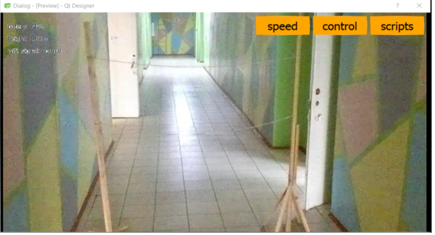
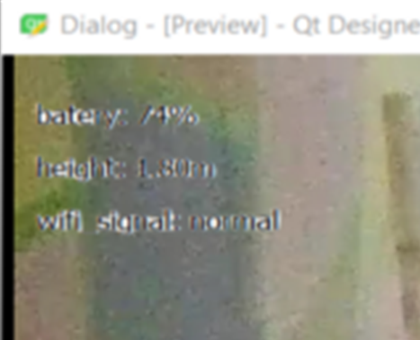

Pioneer Control - программа управления квадрокоптером
=====================================================

.. raw:: html

   

        <iframe src="https://www.youtube.com/embed/oKhEZwBUtkk?list=PLV31ZusyYaebzbHk7L3fdJneqxzEnBbap" allowfullscreen="" style="position: absolute; width:100%; height: 100%;" frameborder="0"></iframe>
   

Участники проекта
-----------------

**Команда:** «Интеллектуалы», МБОУ ДО ДД(Ю)Т г.Ишимбая, Ишимбайский район, Республика Башкортостан.

**Участники:**
 - | Качагин Павел Вячеславович
 - | Губайдулин Инсаф Ишбулатович
 - | Смирнов Данил Сергеевич.

**Проектный наставник:** Рахимова Венера Харисовна.

Описание и цель проекта
-----------------------

Написание программы для управления и запуска скриптов дистанционно на квадрокоптере «Геоскан Пионер Мини». Управление в программе производится нажатием клавиш WASD – для перемещения вперед, назад, вправо и влево.

Решаемые задачи
---------------

 * Управление Пионером Мини c компьютера при помощи клавиш "W A S D" либо стрелок NumPad " ← ↑ ↓ →"
 * Дистанционный запуск Python-скриптов.

Этапы разработки
----------------

Результат
---------

На изображении показан интерфейс программы. Кнопка «speed» отвечает за скорость квадрокоптера(slow/fast). Кнопка «control» предназначена для инвертирования управления, чтобы пользователям было удобно управлять квадрокоптером (меняет местами WASD и стрелочки на NumPad). Кнопка «scripts» отвечает за открытие Python-скрипта.

В левой части окна отображаются показатели квадрокоптера. «Batery» говорит о том, на сколько процентов заряжен АКБ. «Height» сообщает о том, на какой высоте на данный момент летает квадрокоптер(в метрах). «Wifi signal» показывает, насколько хороший сигнал с квадрокоптера.

В дальнейшем планируется добавить в раздел «Scripts» готовые скрипты с примерами для начинающих (освоение программирования на Python). 

Материалы проекта
-----------------

* Презентация: `Pioneer Control - программа управления квадрокоптером <https://storage.yandexcloud.net/pioneer.geoscan.aero/User%20projects/prj-08/Pioneer%20Control%20-%20%D0%BF%D1%80%D0%BE%D0%B3%D1%80%D0%B0%D0%BC%D0%BC%D0%B0%20%D1%83%D0%BF%D1%80%D0%B0%D0%B2%D0%BB%D0%B5%D0%BD%D0%B8%D1%8F%20%D0%BA%D0%B2%D0%B0%D0%B4%D1%80%D0%BE%D0%BA%D0%BE%D0%BF%D1%82%D0%B5%D1%80%D0%BE%D0%BC.pptx>`__

* Исходные файлы программы `Pioneer Control <https://storage.yandexcloud.net/pioneer.geoscan.aero/User%20projects/prj-08/Pioneer%20Control.zip>`__