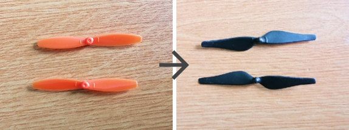

Усовершенствование конструкции Pioneer Mini
===========================================

.. raw:: html

   

        <iframe src="https://www.youtube.com/embed/XbNCpa5UuAE?list=PLV31ZusyYaebzbHk7L3fdJneqxzEnBbap" allowfullscreen="" style="position: absolute; width:100%; height: 100%;" frameborder="0"></iframe>
   

Участники проекта
-----------------

**Команда:** "Геопионеры" г. Томск

**Участники:**
 - | Раухвергер Константин Вячеславович - 3D-моделлер
 - | Цуканов Владимир Николаевич - Программист
 - | Тимофей Скляров - Инженер-схемотехник

**Проектный наставник:** Мотовилов Марк Александрович 

Описание и цель проекта
-----------------------

Целью проекта является улучшение лётных характеристик Pioneer Mini, усиление конструкции рамы и обеспечение плавной посадки.

Решаемые задачи
---------------

 * Замена стандартных воздушных винтов;
 * Новый дизайн конструкции рамы;
 * Замена стандартных ножек на новые, распечатанные на 3d-принтере.

Этапы разработки
----------------

1) Для того чтобы повысить плавность полета, мы решили заменить пропеллеры на дроне. По характеристикам моторов были найдены пропеллеры от дрона "DJI Tello Edu".
Воздушные винты "Tello" имеют чуть больший диаметр, а следовательно они эффективнее перераспределяют усиление опорной рамы. Установив новые лопасти мы убедились, что Pioneer Mini стал летать плавнее, хотя по прежнему не идеально.

2) После того как мы решили установить пропеллеры большего диаметра, мы столкнулись с проблемой - они стали соприкасаться. Было решено переделать раму. Отзеркалив передние лучи мы увеличили расстояние между осевыми линиями воздушных винтов. Дополнительно, такой дизайн привёл к повышению плавности полета.

.. container:: flexrow

	.. figure:: media/img02.jpg

	.. figure:: media/img03.jpg

.. container:: flexrow

	.. figure:: media/img04.jpg

	.. figure:: media/img05.jpg

3) Для осуществления плавной посадки мы решили заменить стандартные ножки на самодельные. Мы сделали макет, распечатали на 3D принтере и закрепили ножки на раме. Для амортизации мы пробовали сделать разные подушечки на самих ножках и эксперементировали с различными материалами:
	
	* Герметик силиконоый  - оказался слишком текучим;
	* Силикон для отливки форм - не удалось воспользоваться по причине отсутсвия в городе;
	* Мягкий пластилин - показал плохой результат, так как плохо фиксировался на луче;
	* Термоклей - оказался не плохим вариантов. Хорошо амортизировал и крепко держался на раме.

.. container:: flexrow

	.. figure:: media/img06.jpg

	.. figure:: media/img07.jpg

	.. figure:: media/img08.jpg

Результат
---------

По результатам проделанной работы мы сделали следующие выводы:

 * Замена рамы и воздушных винтов повлияла на лётные характеристики дрона в лучшую сторону.
 * В результате тестовых полётов были выявлены проблемы с ПО дрона, так как при полётах он периодически падал сразу после включения.
 * Замена ножек не сильно повлияла на видимые качества дрона.
