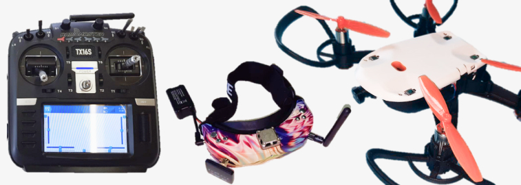

FPV система для квадрокоптера "Пионер мини"
===========================================

.. raw:: html

   

        <iframe src="https://www.youtube.com/embed/h6nM8Ztqwt8?list=PLV31ZusyYaebzbHk7L3fdJneqxzEnBbap" allowfullscreen="" style="position: absolute; width:100%; height: 100%;" frameborder="0"></iframe>
   

Участники проекта
~~~~~~~~~~~~~~~~~

ГУДО "Центр творчества детей и молодежи Борисовского района" Минская область, Республика Беларусь.

**Участники:**
 - | Красник Иван Александрович

**Проектный наставник:** Трухан Виктор Викторович 

Описание и цель проекта
~~~~~~~~~~~~~~~~~~~~~~~

На соревнованиях по робототехнике каждый участник постоянно сталкивается с проблемой передачи изображения на компьютер посредством сетей WI-FI для последующего анализа и выдачи сигналов управления квадрокоптеру. Данный проект способен устранить данную проблему и открывает новые безграничные возможности применения квадрокоптера Pioneer Mini.

Проект представляет собой доработку квадрокоптера Pioneer Mini сверхлегкой FPV видеосистемой работающей на частоте 5.8ГГц и системой FlySky для работы системы управления квадрокоптера. Крепление камеры осуществляется на штатное крепление, а видеопередатчик и приемник FlySky - в нишу между полетным контроллером и аккумулятором.

Колоссальным преимуществом такой видеосистемы и системы управления над стандартной Wi-Fi системой является минимальная задержка, лучшая помехоустойчивость и увеличенная дальность действия, что особенно важно в соревновательной обстановке.

Квадрокоптер Пионер Мини описанный в проекте сохраняет свои качества и приобретает преимущества перед своими конкурентами:

 * Взлетная масса до 110 грамм (не требуется регистрация в качестве беспилотного летательного аппарата);
 * Малые размеры и безопасность, что позволяет запускать его в закрытых помещениях;
 * Высокая прочность и ремонтопригодность;
 * Низкая стоимость дополнительного оборудования; 
 * Расширенная область применения;  
 * Благодаря использованию ноутбука для обработки видеопотока нет необходимости дополнительно нагружать дрон микрокомпьютером, что облегчает программирование и дает прирост вычислительных мощностей.  

Решаемые задачи
~~~~~~~~~~~~~~~

Данный проект представляет собой универсальный комплекс для решения обучающих задач в двух режимах:

* **Камера повёрнута вперёд:**
	- | Квадрокоптер готов окунуть вас с полноценный мир полета по FPV  в видеоочках профессионального уровня;
	- | Аэрофотосъёмка с записью полета на карту памяти;
	- | Участие в соревнованиях на микродронах внутри помещений.

* **Камера повёрнута вниз:**
	- | Квадрокоптер становится способен решать задачи компьютерного зрения  на PYTHON, С/С++ и других языках программирования;
	- | Аэрофотосъёмка с записью полета на карту памяти;
	- | Участие в соревнованиях на микродронах внутри помещений.

Этапы разработки
~~~~~~~~~~~~~~~~

1) В проекте мы использовали: 

 - | FPV  систему  EACHINE  TX-06 SPLIT состоящую из видеокамеры и видеопередатчика 5,8 ГГц  общим весом менее 3 грамм. Оборудование было смонтировано скрытым способом и подключено к разъёму аккумулятора
 
 - | Видеоприемник  EACHINE ROTG–02 подключаемый к USB интерфейсу компьютера.

2) Управление квадрокоптером осуществляется с помощью пульта управления, поддерживающего протокол FlySky (от бюджетной Fly-Sky I6 до аппаратуры с OpenTX типа RadioMaster TX16S), а также компьютером с модулем FlySky FS-RM003 2,4G или мультипротокольным модулем типа Jumper JP4in1.

3) Приемник Flysky FS-RX2A подпаивается к соответствующему порту на полетном контроллере дрона и выдает сигналы управления по PPM протоколу.

4) Программирование можно осуществлять при помощи подключённой к USB порту компьютера Arduino и подключённым к ней внешним ВЧ модулем, поддерживающим PPM, используя любой язык программирования с использованием компьютерного зрения и протоколом Serial для общения с Arduino. В целях популяризации программируемых дронов весь исходный код для полетов будет выложен в репозиторий на площадке `Github <github.com/MicroMalekul/geoscan_fpv>`__.

Результат
~~~~~~~~~

Данная система опробована нашей командой на различных соревнованиях по программируемым дронам на базе квадрокоптера "DJI Tello" и отлично себя зарекомендовала, как надежное «орудие» для достижения поставленных целей и задач, а теперь все наработки мы перенесли на Геоскан Пионер Мини.
Наши многочисленные победы и призовые места по регламентам «Программируемые дроны», «Автономные воздушные аппараты», соревнования по регламентам ООО «Геоскан» говорят сами за себя.

