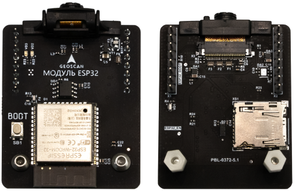

Программируемый модуль ESP32 с CV камерой
=========================================

Модуль предназначен для передачи видеопотока и команд управления на внешние устройства с использованием WiFi. Благодаря этому открываются возможности ранее доступные только на квадрокоптере Пионер Мини, а именно:

	* Управление с мобильного телефона через приложение Geoscan Jump;
	* Блочное программирование;
	* Другие функции приложения Geoscan Jump.

Дополнительно, модуль предоставляет следующий функционал:

	* Программирование на Python с использованием библиотеки pioneer_sdk;
	* Связь с другими устройствами работающие на WiFi, в том числе нейроинтерфейсом и роботом ТРИК и другими Пионерами;
	* Поворотная камера для отработки кейсов с управлением жестами и аэрофотосъемки;
	* Запись логов и видео на SD карту;
	* Открытая прошивка для программирования на С++;

Технические характеристики
--------------------------

	* Процессорный модуль – ESP32 WROOM32;
	* Дальность связи – до 50 метров;
	* Протокол соединения - UART;
	* Макс. разрешение - 640×480: 25 fps — цветное;
	* Напряжение - 3,3 V;
	* Размеры - 145 × 135 × 39 мм;
	* Вес - 18 грамм;

.. important:: Обратите внимание. Параметры автопилота для работы с модулем ESP-32 отличаются от стандартных! По ссылкам ниже вы можете скачать параметры автопилота для работы с модулем ESP-32. |br| Для возврата к управлению с помощью пульта радиоуправления - загрузите стандартные параметры автопилота.

Прошивка модуля ESP-32
----------------------

Обновление прошивки выполняется с помощью программы NJET. Cкачать актуальную версию можно по ссылке - |dnld_njet|. |br| 
Перед началом прошивки модуль ESP32 должен быть отключён от платы подключения доп.модулей. Выполните следующие инструкции для прошивки модуля ESP32.

1. С помощью Pioneer Station убедитесь, что версия автопилота не ниже чем |fw_ap_base|. Подробная инструкция по обновлению прошивки автопилота в разделе: ссылка на раздел.

	.. warning:: Использование неактуальной прошивки автопилота в процессе обновления ESP32 может привести к выводу платы автопилота из строя!  

2. Подключите Пионер к компьютеру кабелем USB и запустите утилиту **NJET**

3. Во вкладке **Expert Mode** убедитесь, что программа автоматически выбрала необходимые для прошивки файлы (После распаковки архива они находятся в папке tools). Если этого не произошло - выберите файлы самостоятельно нажав "..." и указав путь до файла. Убедитесь, что в графе **Target** выбран **pioneer**.

	.. figure:: media/esp32/esp32_fw_upd1.png

4. Во вкладке **Simple Mode** нажмите кнопку **Transfer the board into bridge mode** для перевода платы автопилота в режим моста. 

	.. figure:: media/esp32/esp32_fw_upd2.png

	После сообщения об успешном выполнении - нажмите кнопку **Reset AP board** для выполнения перезагрузки.

	.. figure:: media/esp32/esp32_fw_upd3.png

5. Подключите модуль в соответсвующие разъёмы с **предварительно зажатой кнопкой "BOOT"**. Убедитесь, что на модуле загорелся зелёный светодиод.

6. Нажмите кнопку **Flash ESP32**.

	.. figure:: media/esp32/esp32_fw_upd4.png 

	Дождитесь окончания работы программы. После завершения, в консольном окне будет следующее сообщение: **Leaving... Staying in bootloader. finished, returned None.** Выполните перезагрузку.

	.. figure:: media/esp32/esp32_fw_upd5.png

7. Проверьте список доступных WiFi-сетей на вашем устройсте.
