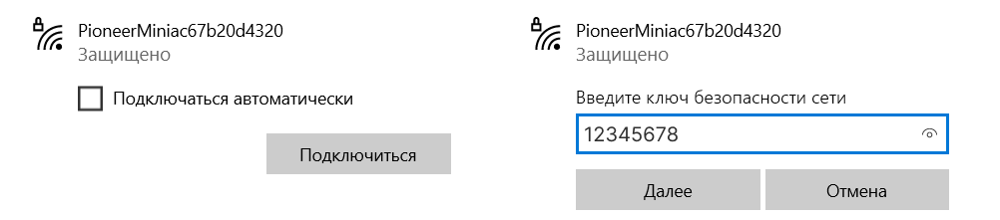

Подготовка к программированию Pioneer Mini на Python
====================================================

Данная страница посвящена общей настройке среды для программирования PyCharm. Здесь описано, как установить всё необходимое ПО, подключить проект pioneer_sdk, настроить квадрокоптер для корректной работы с ПК.

PyCharm — это интеллектуальная Python IDE с полным набором средств для эффективной разработки на языке Python. Выпускается в двух вариантах – бесплатная версия PyCharm Community Edition (рассматриваемая далее) и платная PyCharm Professional Edition. PyCharm выполняет проверку кода в реальном времени, и автодополнение (в том числе основываясь на информации, полученной во время исполнения кода). Кроме того, доступна работа с Git.

Используемое ПО
~~~~~~~~~~~~~~~
.. sidebar:: Для компьютера 

   * `Pioneer Station 1.11 <https://dl.geoscan.aero/pioneer/upload/GCS/GEOSCAN_Pioneer_Station.exe>`__
   * `PyCharm Community Edition <https://www.jetbrains.com/ru-ru/pycharm/download/download-thanks.html?platform=windows&code=PCC>`__
   * `Python <https://www.python.org/downloads/>`__ 

.. sidebar:: Для настройки Пионера:

   * `Прошивка автопилота для Pioneer Mini <https://docs.geoscan.aero/ru/master/instructions/pioneer-mini/settings/firmware_upgrade.html>`__ 
   * `Параметры автопилота для Pioneer Mini <https://docs.geoscan.aero/ru/master/instructions/pioneer-mini/settings/autopilot_parameters.html>`__
   * `Актуальная прошивка ESP-32 <https://docs.geoscan.aero/ru/master/instructions/pioneer-mini/settings/esp32-update.html>`__

Процесс настройки
~~~~~~~~~~~~~~~~~

1. Прежде всего необходимо установить Python на ваш компьютер. Для этого перейдите на `сайт <https://www.python.org/downloads/>`__.
Выберите актуальный релиз из списка и нажмите `Download`. Внизу страницы, в разделе `Files` выберите свою операционную систему. 

.. note:: Библиотека pioneer_sdk работает с версиями python 3.7 - 3.10. На данный момент рекомендуется скачивать версию из указанного диапазона.

.. important:: Обратите внимание на то, что при установки python необходимо выбрать пункт **Add Python to PATH**

   .. figure:: media/img01.png

__________

2. Далее необходимо установить среду разработки `PyCharm Community <https://www.jetbrains.com/ru-ru/pycharm/download/download-thanks.html?platform=windows&code=PCC>`__

   .. figure:: media/img02.png

__________

3. Запускаем PyCharm. При открытии программы нас встречает стартовое окно, в котором можно увидеть следующие вкладки:

   * Поиск и созданные ранее проекты для быстрого доступа;
   * Вкладки создания и открытия проектов;
   * Настройка среды;
   * Установка различных плагинов;
   * Обучение от PyCharm;

   .. figure:: media/img03.png

__________

4. Перейдём к созданию проекта, выбрав опцию 'New Project'

   - | В **верхней** строке `Location` выберем путь для сохранения проекта.
   - | В строке `New environment` using выберем опцию **Virtualenv** для создания виртуального окружения.

   .. figure:: media/img04.png

__________

  Создавая проект для Python, нужно выбрать его окружение. Иначе говоря, нужно ограничить видимость мест, в которых он будет искать установленные библиотеки для проекта. Целесообразно использовать виртуальное окружение в таких случаях:

   - | Если в двух и более проектах необходимо использовать разные версии одной библиотеки. Установленные стандартным образом библиотеки разных версий будут стирать друг друга и всегда будет оставаться только один экземпляр библиотеки. При создании виртуального окружения библиотеки устанавливаются индивидуально для каждого проекта. 

   - | Если вы пользуетесь чужим компьютером, то вам могут запретить доступ к папке, в которой хранятся необходимые библиотеки. В случае использования виртуального окружения для передачи проекта другому пользователю достаточно выполнить лишь одну команду, которая создаст список используемых библиотек. А получателю, соответственно, нужно будет выполнить одну команду с этим списком для установки всех библиотек.

   Как проверить, что для проекта создано виртуальное окружение?

   После создания проекта и настройки окружения открывается следующее окно:

   .. figure:: media/img05.png

   Слева расположено дерево текущего проекта. Обратите внимание, что в корневой папке с названием проекта должна появиться папка с названием **venv** (virtual environment). В нее будут устанавливаться все библиотеки. Внизу рабочей области можно увидеть терминал, в котором тоже указано, что директория, в которой мы находимся, является виртуальной.

__________

   Если все действия выполнены верно, но созданный проект не является виртуальным - откройте настройки PyCharm(Ctrl + Alt + S, либо `File` → `Settings`). В дереве слева выберите раздел `Tools` → `Terminal` и убедитесь, что в графе `Shell path` выбрано **cmd** после чего создайте новый проект.

   .. figure:: media/img06.png

__________

5. Все библиотеки добавляются в проект с помощью **pip install**. Создадим проект, в котором планируется использование библиотеки **pioneer_sdk**. 
Для этого в терминале PyCharm выполним одну из команд:

   ::

      pip install pioneer-sdk 
      python -m pip install pioneer-sdk

После установки можно выполнить импорт установленной библиотеки в проект и запустить пример, использующий ее.

Настройка Pioneer
~~~~~~~~~~~~~~~~~

1. Для работы с Pioneer Mini в первую очередь необходимо проверить актуальность его прошивки автопилота, ESP32 и параметров автопилота. Полный список необходимого ПО с инструкциями описан в начале страницы.

2. Следующим шагом включаем Pioneer Mini и подключаемся к нему по Wi-Fi. Имя сети каждого коптера уникально, но пароль у всех одинаковый: «12345678».

.. attention:: Обратите внимание: профиль сети в настройках Windows должен быть **частным**, а не общественным. В противном случае передача данных между устройствами не будет работать должным образом! Кроме того, для данной сети необходимо отключить брандмауэр Windows.

__________

Запуск скрипта
~~~~~~~~~~~~~~

1. Теперь коптер готов выполнять скрипты. Самое время разобраться, как их запускать! С базовыми скриптами можно ознакомиться, обратившись к примерам в `библиотеке на GitHub <https://github.com/geoscan/pioneer_sdk/tree/master/examples>`__.
Более подробный разбор предоставлен в `документации <https://docs.geoscan.aero/ru/master/programming/python/python-sdk-scripts.html>`__. 
В качестве примера возьмём скрипт **camera_stream.py**.

В проетке создаём новый файл (Alt+Insert), либо File → New. Выбираем тип файла Python File и указываем произвольное название.

__________

2. После создания файл откроется для редактирования и будет доступен в дереве проекта слева. Копируем содержимое скрипта camera_stream.py в наш документ. Как мы видим, первой строкой является import из ранее установленной библиотеки pioneer_sdk. Для запуска скрипта достаточно нажать Ctrl + Shift + F10 либо нажать на пиктограмму с зеленым прямоугольником. Остановка скрипта выполняется по нажатию Ctrl + F2, либо нажатием на иконку с красным квадратом.

.. figure:: media/img12.png

__________

3. После первого запуска данный скрипт автоматически добавится в список конфигураций. При наличии нескольких скриптов в проекте всегда следите, какой из них выбран в конфигурации для запуска. Запускаемый код не всегда соответствует открытому в текущий момент!

